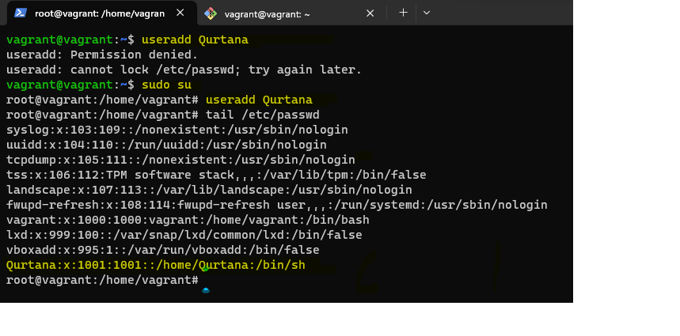
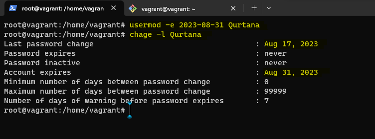
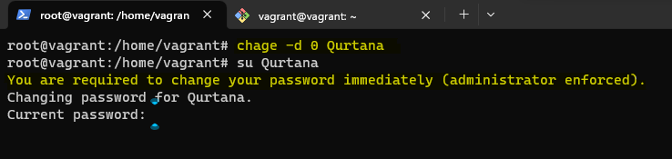
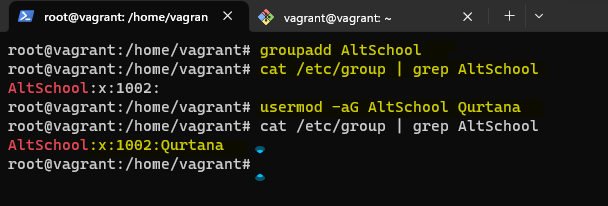
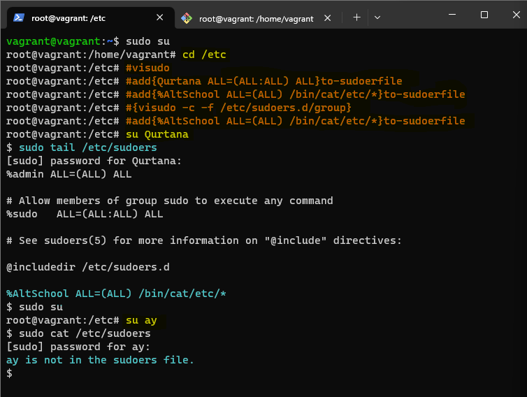
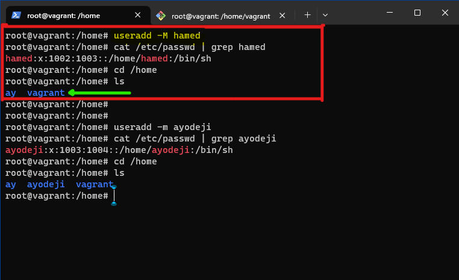

# 1. Create a user

## 2. Set an expiry date of 2weeks for the user

## 3. Prompt the user to change their password on login

## 4. Attach the user to a group called altschool

## 5. Allow altschool group to be able to run only cat command on /etc/

## 6. Create another user without a home directory

